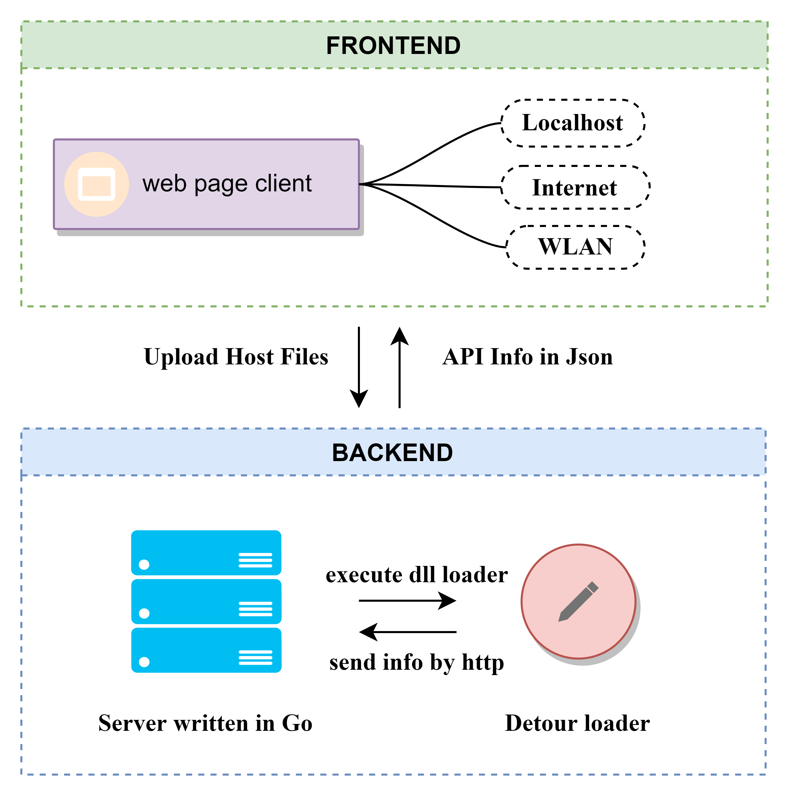

# winTracer

Program API calling tracer in windows implemented by detour.

### How it works

* The web demo is as follows :

  

### Implemetations

* 👉 [winTracer implemented by detour](https://ganliber.github.io/2022/09/13/system/detour-winTracer/)

* Frontend and backend design framework :

  

### How to run this project

* Download the release file and follow [Deployment](s).
* The source cpp files are under folder `/src/test`，while the core files `dllmain.cpp`, `loader.cpp`, `host.cpp` are under folder `/src/hook`, source go files are under folder `/src/server`.

### Dependencies and libraries

* C++ : `url` ( send http request ), `detour` ( hook win32 APIs ), `nlohmann` ( format data as json text )
* Go : `gin` ( web framework for backend ), `net/http` ( native web library )
* Frontend : `amis` ( a low-code front-end framework which uses json configuration to generate pages )
